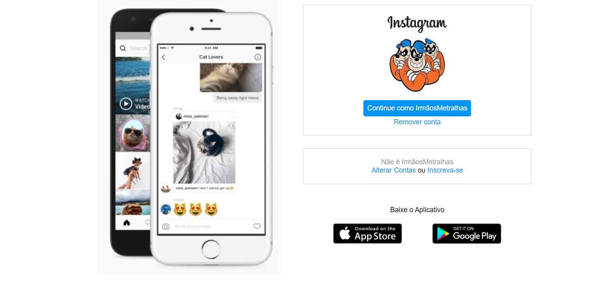

<h3>🎨 Interface Instagram</h3>
<h4>✨ Desafio Digital Innovation One 🌎</h4>

 💻 Neste projeto foi reconstruido a página inicial de login do Instagram, no qual foi abordado e estudados os conceito sobre CSS.

<h4> 😁 Demonstração:</h4>

<h2 aling="Center">
    
</h2>